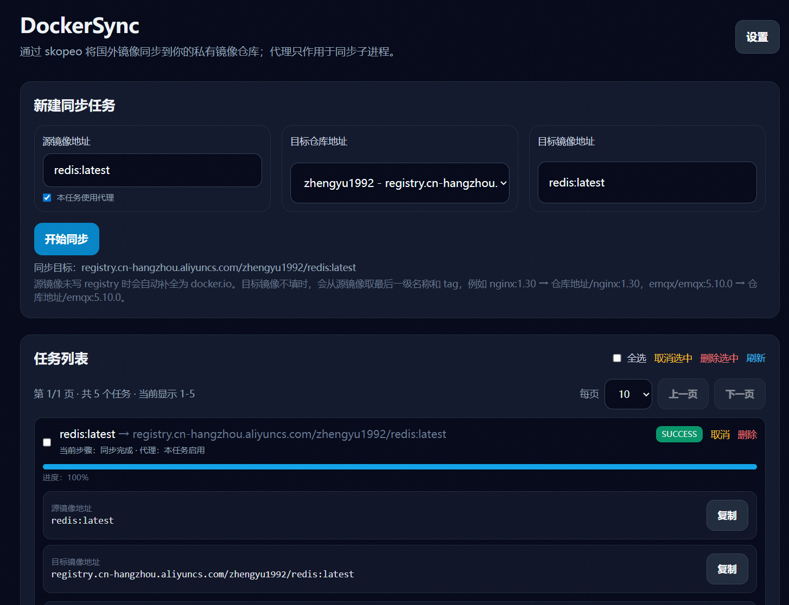

# DockerSync

轻量 Web 工具，用 `skopeo copy` 将 Docker Hub 等镜像同步到自己的私有镜像仓库。

## 界面预览



> 请将截图保存为 `docs/example.png`，README 会自动显示该范例图。

## 特性

- Web 界面管理目标仓库账号密码
- Web 界面创建镜像同步任务
- SQLite 保存配置、任务记录和任务日志
- 不依赖 Docker daemon，不需要挂载 `/var/run/docker.sock`
- 代理地址统一在设置页配置，是否使用代理由每个任务单独勾选
- push 目标仓库会通过 `NO_PROXY` 排除，避免目标仓库走代理

## Docker 运行

推荐先创建数据目录，用于持久化 `dockersync.db`：

```bash
mkdir -p data
```

启动服务：

```bash
docker run -d \
  --name dockersync \
  --network host \
  --restart always \
  -v $(pwd)/data:/app/data \
  registry.cn-hangzhou.aliyuncs.com/zhengyu1992/dockersync:latest
```

访问控制台：

```bash
http://服务器IP:8080
```

本机运行时也可以访问：

```bash
http://127.0.0.1:8080
```

## Docker Compose 运行

等价的 `docker-compose.yml` 示例：

```yaml
services:
  dockersync:
    image: registry.cn-hangzhou.aliyuncs.com/zhengyu1992/dockersync:latest
    container_name: dockersync
    network_mode: host
    restart: always
    volumes:
      - ./data:/app/data
```

启动：

```bash
mkdir -p data
docker compose up -d
```

查看日志：

```bash
docker logs -f dockersync
```

停止：

```bash
docker compose down
```

## 页面使用示例

以同步 `nginx:latest` 为例：

- 源镜像地址：`nginx:latest`
- 目标仓库地址：`registry.cn-hangzhou.aliyuncs.com/zhengyu1992`
- 目标镜像地址：`nginx:latest`
- 最终同步目标：`registry.cn-hangzhou.aliyuncs.com/zhengyu1992/nginx:latest`

如果源镜像没有写 registry，系统会自动补全为 Docker Hub，例如：

```text
nginx:latest -> docker.io/nginx:latest
```

如果目标镜像地址不填，系统会从源镜像中取最后一级镜像名和 tag，例如：

```text
nginx:1.30 -> registry.cn-hangzhou.aliyuncs.com/zhengyu1992/nginx:1.30
emqx/emqx:5.10.0 -> registry.cn-hangzhou.aliyuncs.com/zhengyu1992/emqx:5.10.0
```

## 代理说明

在设置页填写代理地址，例如：

```bash
socks5://127.0.0.1:7890
```

创建任务时勾选“本任务使用代理”，该任务拉取源镜像时才会走代理；未勾选的任务不会使用代理，适合国内阿里云、华为云等镜像源。

目标仓库会加入 `NO_PROXY`，所以 push 到目标仓库不会走代理。

## 数据持久化

容器内数据目录为：

```bash
/app/data
```

默认数据库文件为：

```bash
/app/data/dockersync.db
```

建议始终挂载：

```bash
-v $(pwd)/data:/app/data
```

否则容器删除后，仓库配置、代理配置、任务记录和任务日志都会丢失。
